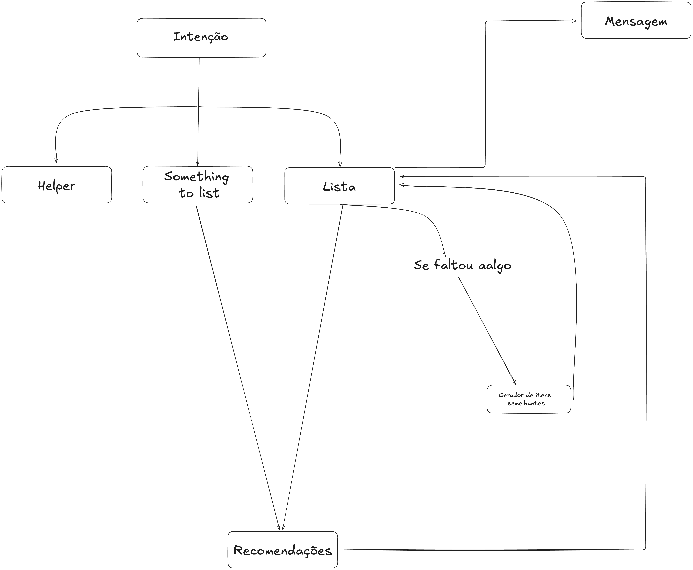

# UBER Chat Shopping System - Process Flow

## Imagem


### Observações
OBS:
- Limitar os ciclos de recomendações e substituição de produto
- Recomendação e substituição por supermercado

## 1. Initial Customer Interaction

**Customer Flow:**
- The customer sends a shopping list through the chat interface.
- The LLM analyzes the list:
  - If the list is **unstructured** or **ambiguous**, it requests clarification from the user.
  - The conversation is maintained using **threads** to preserve context and already provided items.

**Key Considerations:**
- Maintain context using threads.
- Ensure all necessary items are captured.

## 2. List Processing System

**Core Functionalities:**
- **Thread Management:**
  - Maintains conversation context.
  - Tracks confirmed items.
  - Stores user preferences and restrictions.

**Planned Enhancements:**
- Allergy detection.
- Recipe-based shopping list generation.
- Personalized product recommendations.
- Dietary restrictions handling.

## 3. Database Search Process

**Search Steps:**
1. Search the database for products matching item names or descriptions from the shopping list.
2. Apply **cosine similarity** filtering using embeddings to refine results.

**Notes:**
- Cosine similarity works better with phrases rather than single words.
- Testing required to optimize for similar word matches.

## 4. Response Flow

**Processing Results:**
- The database returns results in **JSON** format.
- The LLM analyzes the JSON:
  - Lists available products.
  - Identifies missing items.
  - Suggests alternatives if available.

**Response to Customer:**
- A natural language message summarizing the findings.
- Includes the JSON data with available, missing items, and suggestions.

## 5. Response Format

```json
{
    "found_items": {
        "market_name": {
            "address": "store_address",
            "products": {
                "category": {
                    "product_name": {
                        "price": 0.00,
                        "description": "product_description"
                    }
                }
            }
        }
    },
    "missing_items": ["item1", "item2"],
    "suggestions": {
        "item1": ["alternative1", "alternative2"]
    }
}
```

---
**Note:**
- Thread-based conversation ensures continuity.
- Additional flows for allergy detection, recipe generation, and product recommendations will be integrated.
- Currently using **OpenAI GPT API** for the LLM, but planning to transition to a **local model** for more control and reduced dependencies.

