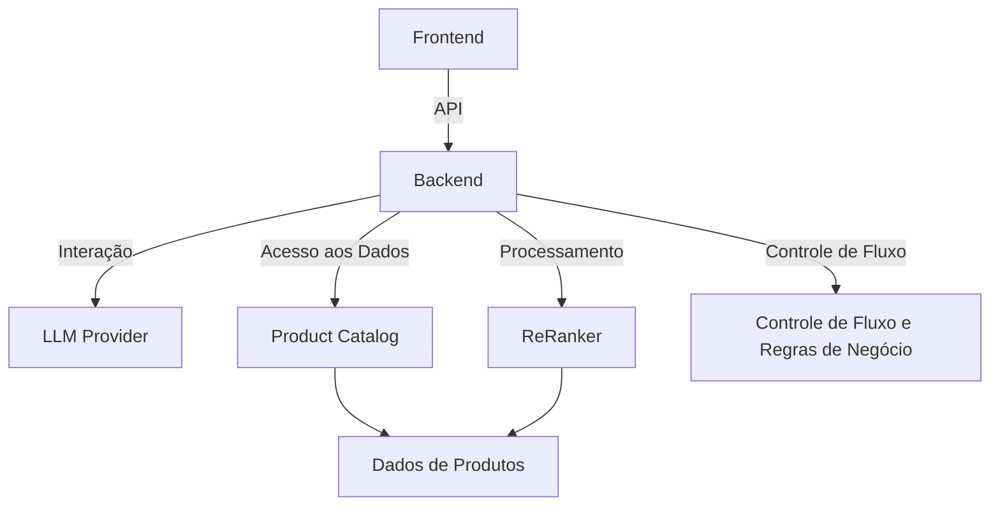
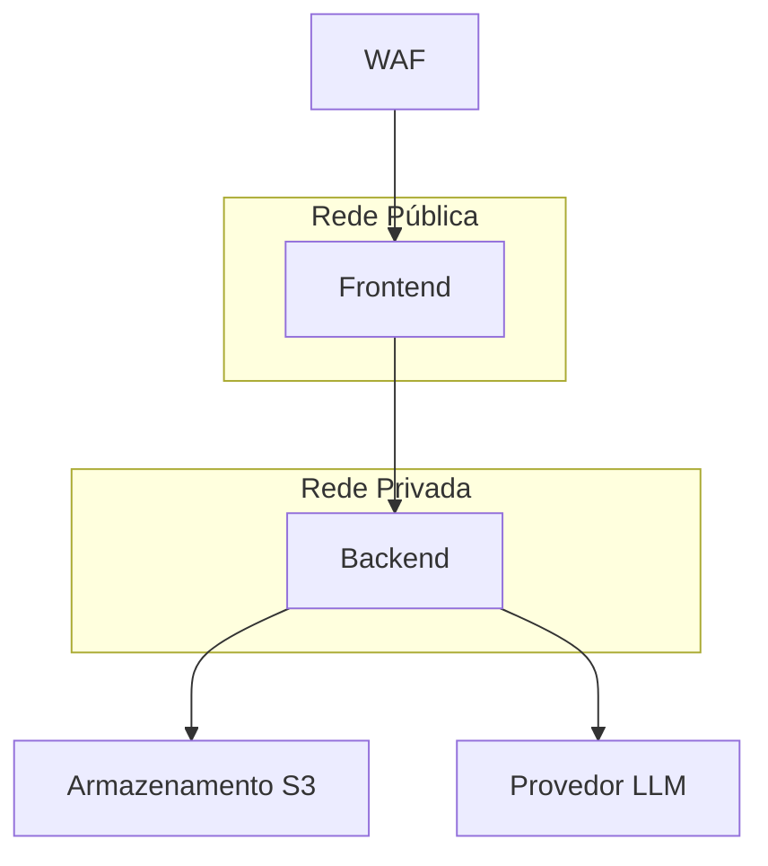
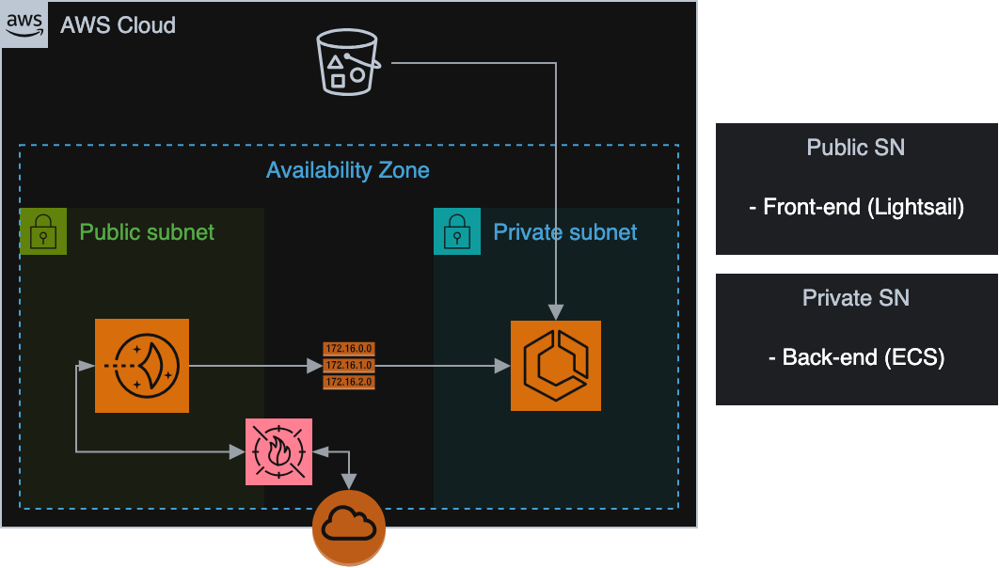

Relatório de Arquitetura de Software
===

## Visão Geral

Esta solução visa proporcionar uma experiência inteligente na criação de listas de compras, utilizando um modelo de linguagem natural (LLM) para processar entradas em linguagem natural do usuário e gerar listas de compras detalhadas e personalizadas. A aplicação é projetada para funcionar sem depender de bancos de dados tradicionais, mantendo todos os dados relevantes em memória, o que oferece alta performance e simplicidade na arquitetura.

Os fluxos de interação com o usuário são os principais mecanismos que direcionam o processamento da aplicação, sendo divididos em três fluxos principais:

1. **Fluxo Helper (Ajuda)** – Oferece instruções e orientações sobre como usar a aplicação.
2. **Fluxo List to Smart List** – Permite ao usuário fornecer uma lista de compras detalhada, que é processada e estruturada para encontrar os produtos correspondentes.
3. **Fluxo Desire to Smart List** – Permite que o usuário especifique um desejo ou necessidade (como um prato de comida) e o sistema sugira produtos relacionados.

A arquitetura da aplicação é simplificada e eficiente, sem a necessidade de bancos de dados ou sistemas de armazenamento externos. Toda a lógica de negócios e os dados necessários para a operação são mantidos em memória, o que facilita a escalabilidade e o desempenho da aplicação.

### 1. **Frontend (Interface de Usuário)**

O frontend é implementado utilizando **React Native** com **Expo**, proporcionando uma interface fluida e responsiva para o usuário. O papel do frontend é receber as entradas do usuário, enviar essas informações ao backend para processamento e exibir as respostas geradas.

- **Tecnologia:** React Native + Expo
- **Responsabilidade:** Fornecer uma interface interativa e apresentar as listas de compras e recomendações para o usuário.

### 2. **Backend (Controle de Fluxo e Agentes LLM)**

O backend da aplicação é composto por uma única camada responsável por gerenciar o fluxo de dados e interagir com os modelos de linguagem natural (LLM). Não há banco de dados tradicional ou vetorial; todos os dados relevantes são mantidos em memória durante o ciclo de vida da aplicação.

#### 2.1 Processamento de Entrada

Quando o usuário envia uma lista de compras ou expressa um desejo (como "bolo de chocolate"), o backend recebe essa entrada em linguagem natural e processa as informações. O processamento envolve a conversão da entrada em um formato estruturado (como JSON), facilitando a busca por produtos.

#### 2.2 Armazenamento em Memória

Todos os dados necessários para a operação do sistema, como a lista de produtos e suas informações associadas (nome, preço, marca, etc.), são armazenados na memória durante a execução. Não há dependência de banco de dados, o que resulta em uma solução mais leve e rápida.

- **Tecnologia:** Armazenamento em memória
- **Responsabilidade:** Manter os dados dos produtos e outras informações necessárias durante a execução.

#### 2.3 Processamento de Embedding

Em vez de usar um banco de dados vetorial, o backend processa as entradas do usuário por meio de embeddings simplificados para identificar produtos relevantes. As entradas e produtos são comparados diretamente em memória com métodos de similaridade ou correspondência de strings.

#### 2.4 Agentes LLM (Modelos de Linguagem Natural)

O sistema integra um modelo de linguagem natural (LLM), que pode ser conectado via API a diferentes provedores, como OpenAI ou Ollama. Este modelo é utilizado para interpretar e processar as entradas dos usuários, convertendo comandos em linguagem natural em respostas estruturadas.

- **Tecnologia:** Modelos de LLM (via API - OpenAI, Ollama, etc.)
- **Responsabilidade:** Interpretar entradas em linguagem natural e gerar respostas relevantes e estruturadas.

#### 2.5 Controle de Fluxo e Regras de Negócio

O backend é responsável por definir e gerenciar o controle de fluxo da aplicação. Dependendo do tipo de entrada do usuário (se ele precisa de ajuda, se já tem uma lista de compras ou se deseja sugerir um prato específico), o backend determina qual fluxo seguir e processa a resposta.

- **Tecnologia:** Sistema de controle de fluxo no backend
- **Responsabilidade:** Direcionar as entradas para os fluxos adequados e aplicar as regras de negócio para garantir respostas precisas e relevantes.

#### 2.6 ReRanker

Após a seleção inicial dos produtos, o **ReRanker** aplica um filtro adicional para reclassificar os itens de acordo com sua relevância e contexto, garantindo que a lista de produtos gerada seja o mais precisa possível. Este processo é realizado diretamente em memória, sem a necessidade de um banco de dados adicional.

- **Tecnologia:** Algoritmo de reclassificação simples em memória
- **Responsabilidade:** Refinar e classificar os produtos de maneira que a resposta final seja a mais relevante para o usuário.

## Arquitetura na Nuvem (AWS)

A aplicação será hospedada na **AWS (Amazon Web Services)**, utilizando diversos serviços da plataforma para garantir alta disponibilidade, escalabilidade e segurança. O uso da nuvem proporciona flexibilidade para crescer conforme a demanda, além de reduzir a complexidade do gerenciamento de infraestrutura. A arquitetura será dividida entre o **Backend**, que ficará hospedado no **ECS (Elastic Container Service)**, e o **Frontend**, que ficará no **Lightsail**.

</img>

### 1. **Backend no ECS**

O **Backend** será hospedado no **Amazon ECS (Elastic Container Service)**, um serviço gerenciado de orquestração de containers. A containerização traz diversas vantagens para o desenvolvimento e operação da aplicação, como:

- **Portabilidade**: A containerização permite que a aplicação seja facilmente movida entre ambientes de desenvolvimento, teste e produção sem alterações significativas no código ou configuração.
- **Escalabilidade**: O ECS facilita o escalonamento horizontal, ou seja, a capacidade de aumentar ou diminuir o número de instâncias de containers conforme a demanda. Isso é especialmente útil para lidar com variações no tráfego de usuários.
- **Consistência e Isolamento**: A utilização de containers garante que o ambiente de execução seja consistente em todos os pontos de execução (local, desenvolvimento, produção). Além disso, containers isolam diferentes partes da aplicação, tornando o gerenciamento mais simples.
- **Gerenciamento Simplificado**: A AWS cuida do gerenciamento de infraestrutura de containers, permitindo que os desenvolvedores se concentrem na aplicação em si, sem a necessidade de gerenciar servidores diretamente.

**Rede Privada**: O Backend estará isolado em uma rede privada para garantir que o tráfego seja restrito e controlado, oferecendo uma camada extra de segurança contra acessos não autorizados.

#### Alternativas ao ECS:

- **API Gateway + Lambda**: Uma alternativa ao uso do ECS seria o uso do **Amazon API Gateway** combinado com **AWS Lambda**. O **API Gateway** atua como ponto de entrada para as requisições da API, enquanto o **Lambda** processa as requisições de forma serverless (sem servidor). Essa abordagem pode ser vantajosa para aplicações de baixo tráfego ou microserviços, já que não requer provisionamento de infraestrutura.

### 2. **Frontend no Lightsail**

O **Frontend** será hospedado no **Amazon Lightsail**, que oferece uma maneira simples e econômica de hospedar aplicativos web. O Lightsail fornece instâncias de servidor virtuais (semelhantes ao EC2) e outras ferramentas como gerenciamento de DNS, balanceamento de carga, e armazenamento de objetos, ideal para pequenas e médias aplicações.

#### Alternativas ao Lightsail:

- **ECS**: O **ECS** também pode ser utilizado para hospedar o frontend, oferecendo mais controle sobre a infraestrutura. Isso pode ser interessante para grandes aplicações, onde o controle e a flexibilidade são essenciais.
- **EC2**: O **EC2** poderia ser utilizado para ter mais controle sobre o ambiente de execução. Porém, ele exigiria mais configuração e gerenciamento, o que pode aumentar a complexidade do sistema, principalmente se comparado com a simplicidade do Lightsail.

### 3. **WAF (Web Application Firewall)**

A aplicação será protegida por um **WAF (Web Application Firewall)** para evitar ataques externos, como **SQL Injection**, **Cross-Site Scripting (XSS)** e outros tipos de vulnerabilidades comuns em aplicativos web. O **AWS WAF** permite que você configure regras específicas para bloquear tráfego malicioso e proteger os recursos da aplicação. Isso é essencial para garantir a segurança e a integridade dos dados, principalmente em ambientes expostos à internet.

- **Tecnologia**: AWS WAF
- **Responsabilidade**: Proteger a rede da aplicação contra ataques externos, garantindo que apenas tráfego legítimo chegue aos serviços da AWS.

### 4. **Armazenamento de Dados no S3**

Os dados necessários para o backend, como os **blobs** dos produtos ou arquivos de configuração, serão armazenados no **Amazon S3** (Simple Storage Service). O S3 oferece uma solução robusta e escalável para armazenar grandes volumes de dados, com alta durabilidade e disponibilidade.

- **Tecnologia**: Amazon S3
- **Responsabilidade**: Armazenar os dados necessários para a aplicação de forma segura e eficiente. O S3 será usado para armazenar os arquivos de dados utilizados pelo backend, como listas de produtos, informações sobre as transações e outros arquivos que precisam ser processados ou recuperados.

O S3 será configurado para garantir que os dados sejam acessíveis apenas pelos serviços autorizados, com controles de acesso bem definidos.
